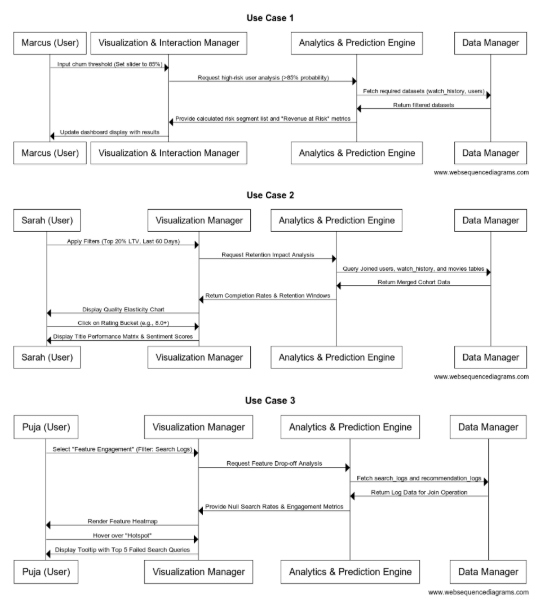

# Component Specification

## 1. Data Manager
This component handles all raw data ingestion, cleaning, and aggregation. It is responsible for gathering raw information from various sources and transforming it into a structured format ready for deep analysis. 
- What it does:
	- Data Ingestion & Cleaning: collects subscription records, watch history, search logs, recommendations, ratings, and content metadata. Also performs EDA (Exploratory Data Analysis) to identify missing values, outliers, and trends such as average watch time, session frequency, and content popularity by region.
	- Feature Engineering: Transforms cleaned data into meaningful features for churn prediction and analysis. This includes session frequency, watch time, engagement trends, content preferences, demographic attributes, and geographic information.
- **Inputs:** Subscription, content, user behavior datasets (CSV), and an external movie/TV show rating API.
- **Outputs:** Cleaned, merged, and aggregated datasets ready for feature engineering, visualization, and ML models.

## 2. Analytics & Prediction Engine
This component is the brain of the system. It processes the featured data to generate intelligence, such as risk scores and business simulations. 
- What it does:
	- Churn Prediction: Trains and evaluates models to predict which users are likely to cancel their subscription. This component includes model training, selection, fine-tuning, and evaluation. Provides insight into which features most likely influence business decisions.
	- User Segmentation: Groups users into risk-based or behavior-based clusters for clear analysis and decision-making. Segmentation can be based on behavior, engagement patterns, plan type, geography etc. Can aid in early detection of high-risk users.
	- Retention Simulation: Calculates the financial impact of business decisions such as discount offers or content investments. 
- **Inputs:** Featured tables from the Data Manager. 
- **Outputs:** Churn probabilities, User segments with risk scores, analysing patterns driving churn, data-driven recommendations, Model performance metrics (accuracy, recall, F1-score), Predicted retention outcomes, estimated cost/revenue impact.

## 3. Visualization & Interaction Manager
This component involves creating interactive dashboards (front-end component) tailored to different stakeholders (like Product Manager, Marketing Manager, Studio Executive). Here, trends can be observed in churn risk, engagement patterns, content popularity, and revenue. Allows filtering by region, plan type, content type, or content rating.
- What it does:
	- Interactive Dashboard: Renders visual tools like the “Risk Segment List”, “Feature Heatmaps”, and “Quality Elasticity Charts”.
	- Content & Feature Analysis: Provides deep-dive views into how content quality or app features correlate with user churn.
	- User Interaction Handling: Processes filters (e.g., slider adjustments, region filtering), and handles file exports (CSVs)
- **Inputs:** Analyzed metrics from Analytics & Prediction Engine.
- **Outputs:** Interactive dashboard with plots, filtered tables, tooltips, and exported CSV files.

